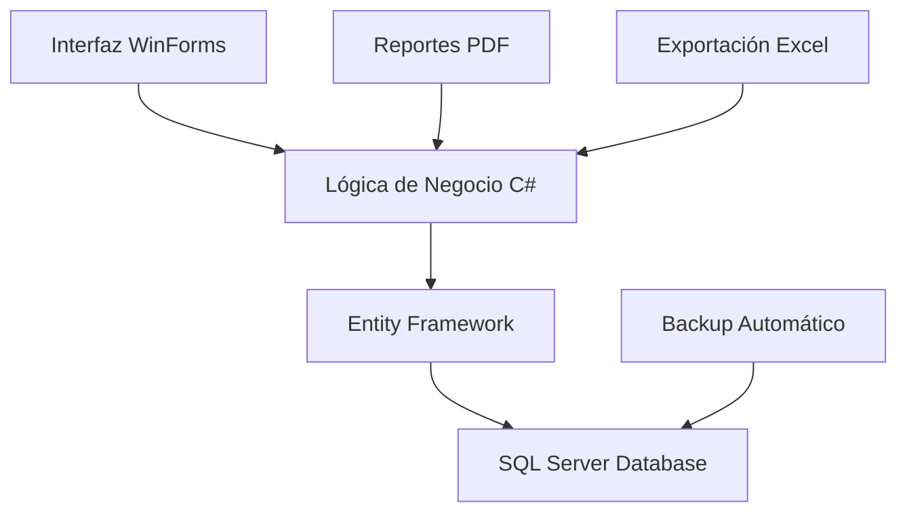
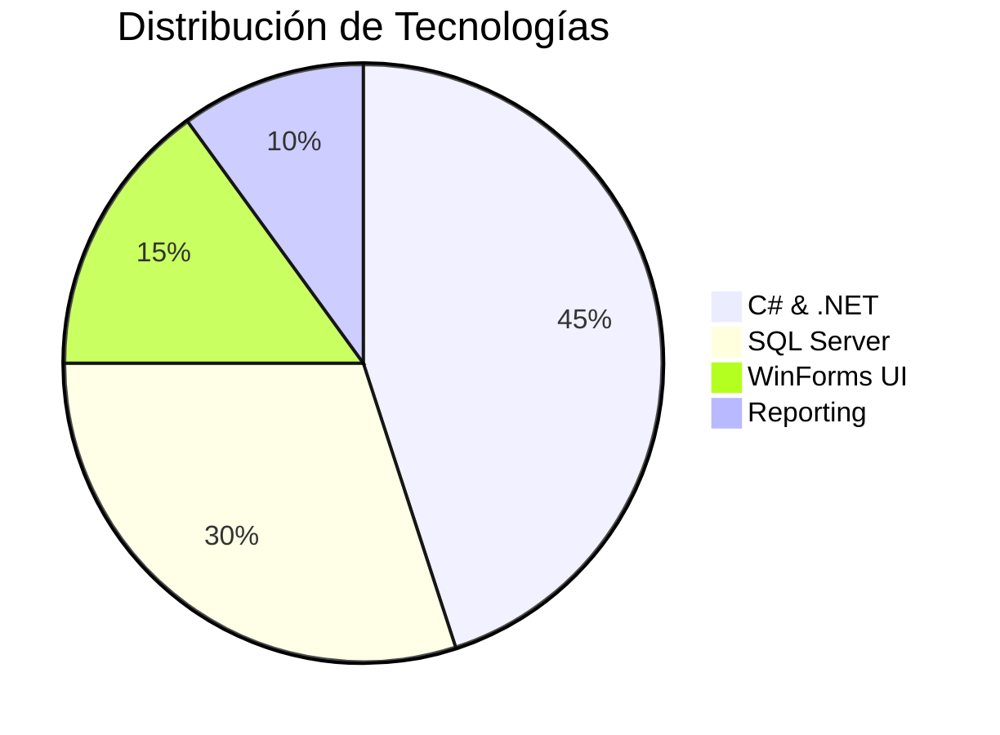
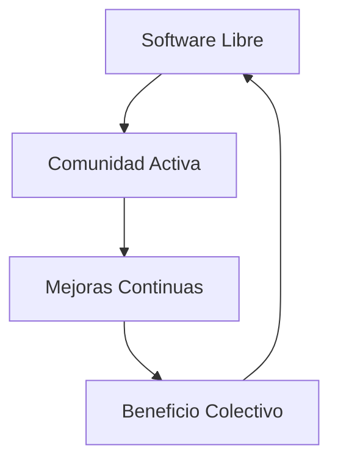

# 🏪 **SisInv+ | Sistema de Inventario & Ventas**  

**Solución integral para PYMES** | *"Control total, crecimiento sencillo"*  


---

## 🌟 **Características Principales**

### 📦 **Gestión de Inventario**
- ✅ **Control en tiempo real** de stock y productos
- 📊 **Alertas automáticas** de stock bajo
- 🔄 **Sistema multi-sucursal** integrado
- 🏷️ **Categorización avanzada** de productos

### 💰 **Módulo de Ventas**
- 🧾 **Facturación electrónica** integrada
- 📈 **Dashboard de ventas** con métricas
- 👥 **Gestión de clientes** y historial
- 💳 **Múltiples métodos** de pago

### 📊 **Reportes & Analytics**
- 📋 **Reportes automáticos** en PDF/Excel
- 📉 **Análisis de tendencias** de ventas
- 🔍 **Filtros avanzados** por fecha y categoría
- 📱 **Exportación multiplataforma**

---

## 🛠️ **Tecnologías Utilizadas**

### 🔧 Backend & Base de Datos
- **C# (.NET Framework)** - Lenguaje principal
- **SQL Server** - Base de datos relacional
- **Entity Framework** - ORM para persistencia
- **Windows Forms** - Interfaz de usuario

### 📊 Reporting & Exportación
- **iTextSharp** - Generación de PDF
- **ClosedXML** - Exportación a Excel
- **Chart.Windows** - Gráficos y visualizaciones

### 🔐 Seguridad
- **Autenticación Windows** o personalizada
- **Encriptación** de datos sensibles
- **Backup automático** de base de datos

---

## 🏗️ **Arquitectura del Sistema**



---

## 🚀 **Instalación y Configuración**

### Prerrequisitos
- **Windows 10/11** o Windows Server 2019+
- **.NET Framework 4.8**
- **SQL Server 2019** o superior
- **4GB RAM** mínimo, 8GB recomendado

### ⚡ Instalación Rápida
```bash
# 1. Clonar repositorio
git clone https://github.com/Astharmin/SisInv_MiniMark.git

# 2. Restaurar base de datos
# Ejecutar script SQL incluido

# 3. Configurar conexión
# Editar archivo App.config

# 4. Compilar y ejecutar
# Abrir solución en Visual Studio
```

### 🔧 Configuración de Base de Datos
```sql
-- Script de creación automática
USE master;
CREATE DATABASE SisInvPlus;
-- La aplicación crea las tablas automáticamente
```

---

## 📊 **Métricas del Sistema**



---

## 📜 **Licencia GPL v3.0**

Este proyecto está licenciado bajo la **GNU General Public License v3.0**.

### 🔑 **Derechos y Libertades**
- ✅ **Usar** el software para cualquier propósito
- ✅ **Estudiar** cómo funciona y adaptarlo a tus necesidades
- ✅ **Distribuir** copias a terceros
- ✅ **Mejorar** el software y publicar tus mejoras

### 📋 **Condiciones Principales**
- Las obras derivadas deben usar la **misma licencia GPL v3.0**
- Debe incluirse el **código fuente** completo
- Se debe mantener la **atribución** original
- Los cambios deben estar **documentados**

### 📄 **Texto Completo de la Licencia**
Consulta el archivo completo [LICENSE](LICENSE) para todos los términos y condiciones.

---

<div align="center">

### ⭐ ¿Te gusta este proyecto? ¡Déjame una estrella en GitHub!

**Desarrollado con ❤️ por [Astharmin](https://github.com/Astharmin)**

*"Software libre para PYMES libres"*



</div>
