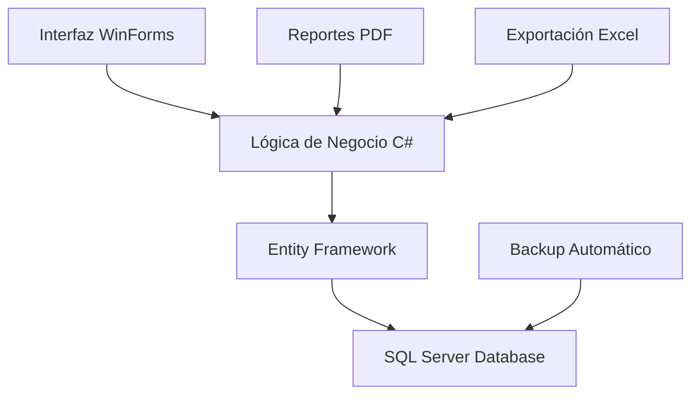

# 🏪 **SisInv+ | Sistema de Inventario & Ventas**


**Solución integral para PYMES** | _"Control total, crecimiento sencillo"_

---

## 🌟 **¿Qué es SisInv+?**

**SisInv+** es un sistema de gestión integral diseñado para pequeñas y medianas empresas que buscan **control total** sobre su inventario, ventas y clientes. Olvídate del desorden y de las hojas de cálculo. Este software te ofrece una plataforma sólida, construida con **C# y SQL Server**, para centralizar y optimizar tu negocio.

### **Características Principales**

| Módulo | Funcionalidades Clave |
| :--- | :--- |
| 📦 **Inventario** | Control en tiempo real, alertas de stock bajo, gestión multi-sucursal, categorización avanzada de productos. |
| 💰 **Ventas** | Facturación electrónica, dashboard con métricas, gestión de clientes e historial, múltiples métodos de pago. |
| 📊 **Reportes** | Generación automática de reportes en PDF/Excel, análisis de tendencias de ventas, filtros avanzados por fecha y categoría, exportación a múltiples formatos. |

---

## 🛠️ **Tecnologías Utilizadas**

*   **C# (.NET Framework):** Lenguaje principal para la lógica de negocio.
*   **SQL Server:** Base de datos relacional robusta y confiable.
*   **Entity Framework:** ORM para simplificar la interacción con la base de datos.
*   **Windows Forms:** Framework para una interfaz de usuario clásica y eficiente.
*   **iTextSharp / ClosedXML:** Librerías para la generación de reportes en PDF y Excel.
*   **Chart.Windows:** Para la visualización de datos y gráficos.

---

## 🏗️ **Arquitectura del Sistema**

El sistema sigue una arquitectura por capas que separa la presentación, la lógica de negocio y el acceso a datos, lo que facilita su mantenimiento y escalabilidad.



---

## 🚀 **Instalación y Configuración**

### **Prerrequisitos**

*   **Sistema Operativo:** Windows 10/11 o Windows Server 2019+.
*   **Framework:** .NET Framework 4.8.
*   **Base de Datos:** SQL Server 2019 o superior.
*   **Hardware:** 4GB RAM (mínimo), 8GB RAM (recomendado).

### **Pasos Rápidos**

1.  **Clona el repositorio**
    ```bash
    git clone https://github.com/Astharmin/SisInv_MiniMark.git
    ```

2.  **Configura la Base de Datos**
    *   La aplicación incluye scripts para la creación automática de la base de datos.
    *   Puedes ejecutar el script `CREATE DATABASE SisInvPlus;` manualmente o permitir que la aplicación lo haga al iniciar.

3.  **Configura la Conexión**
    *   Edita el archivo `App.config` para establecer la cadena de conexión a tu instancia de SQL Server.

4.  **Compila y Ejecuta**
    *   Abre la solución en Visual Studio y compila el proyecto. ¡El sistema está listo para usar!

---

## 📜 **Licencia y Contribuciones**

### **Licencia Pública General de GNU v3.0**

Este proyecto se distribuye bajo los términos de la **GPL v3.0**, una licencia que protege tus libertades y las de los usuarios. Puedes:

*   ✅ Usar, estudiar y compartir el software.
*   ✅ Modificarlo y adaptarlo a tus necesidades.
*   ✅ Distribuir copias y mejoras, siempre que mantengas la misma licencia y atribución.

Consulta el archivo `LICENSE` para conocer todos los términos y condiciones.

### 🤝 **¿Cómo Contribuir?**

Este es un proyecto en activo. Si tienes ideas, encuentras errores o quieres mejorar el sistema:

1.  Haz un **Fork** del repositorio.
2.  Crea una rama para tu funcionalidad (`git checkout -b feature/AmazingFeature`).
3.  Realiza tus cambios y haz commit (`git commit -m 'Add some AmazingFeature'`).
4.  Sube tus cambios (`git push origin feature/AmazingFeature`).
5.  Abre un **Pull Request** para revisar tu contribución.

---

⭐ **¿Te gusta este proyecto? ¡Déjame una estrella en GitHub!**

**Desarrollado con ❤️ por [Astharmin](https://github.com/Astharmin)**

_"Software libre para PYMES libres"_
